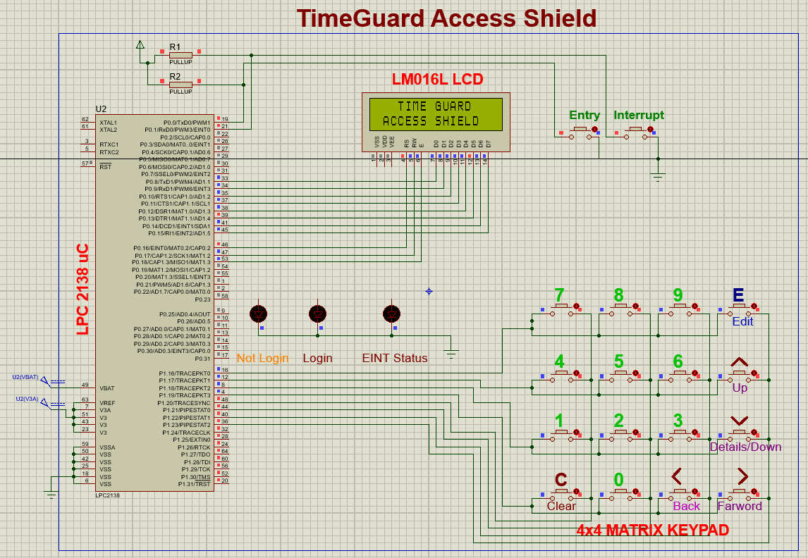

# 🛡️ TimeGuard Access Shield — Password-Controlled Time-Restricted Machine Operation System

TimeGuard Access Shield is an embedded access-control system built using the **LPC2148** microcontroller.  
It combines **secure password authentication**, **RTC-based scheduling**, and an **interrupt-driven configuration menu** to ensure that only authorized users can operate a device — and only at allowed times.

---
## 📸 Project Images

### Proteus Image


---

## 🔐 Features

-   🕒 **Real-Time Clock Display** (Time, Date, Day)\
-   🔑 **Password-Based Authentication** (Changeable Password)\
-   🚪 **Entry Access Only in Working Hours**\
-   ⚙️ **Admin Menu via EINT0 Interrupt**
    -   Change Date\
    -   Change Time\
    -   Change Password\
    -   Change Working Hours\
-   ⚡ **Edge-Triggered EINT0 Interrupt Handling**
-   🎨 LCD Custom Characters (Lock, Success, Warning, Clock Icons)
-   ❌ Blocks login after 3 failed attempts\
-   📟 Full RTC configuration and live display

------------------------------------------------------------------------

## 🧩 Hardware Requirements

-   **LPC2129 / LPC2148 or any LPC21xx**
-   **16x2 LCD (HD44780)**
-   **4x4 Matrix Keypad**
-   **External Interrupt Switch (EINT0)**
-   **RTC Module (DS1307 or compatible)**
-   **Power Supply 5V**
-   **Connection Wires & Breadboard/PCB**

------------------------------------------------------------------------

## 📁 Project Structure

    /project
    │-- main.c
    │-- lcd.c / lcd.h
    │-- rtc.c / rtc.h
    │-- kpm.c / kpm.h (Keypad Driver)
    │-- system_init.c
    │-- delay.c / delay.h
    │-- arduino.c (digitalRead wrapper)
    │-- pin_connect_block.h
    │-- types.h

------------------------------------------------------------------------

## ⚙️ Key Functionalities

### 1️⃣ **Login Authentication**

-   Accepts a 4-digit password\
-   Displays `*` for each digit\
-   Supports backspace using `C` key\
-   Allows only **3 attempts**, then locks system

------------------------------------------------------------------------

### 2️⃣ **Working Hours Check**

System allows entry **only between configured Entry & Exit hours**:

``` c
if((EnHr <= cHour) && (ExHr >= cHour)) return 1;
```

------------------------------------------------------------------------

### 3️⃣ **Admin Menu (Triggered by EINT0 Interrupt)**

Press external interrupt switch → LCD prompts to press `1` for menu.

Menu options:

    1 – Change Date
    2 – Change Time
    3 – Change Password
    4 – Employee Working Hours
    5 – Exit

------------------------------------------------------------------------

### 4️⃣ **RTC Setup & Display**

Live updating of: - Time (HH:MM:SS) - Date (DD/MM/YYYY) - Day (SUN--SAT)

------------------------------------------------------------------------

## 🚀 How to Use

### ▶️ **Startup**

-   System shows title screen\
-   Then continuous RTC display\
-   Press **ENTRY switch** → Login window

### ▶️ **Admin Control**

-   Press **EINT0 switch**\
-   Press **1** to open the menu

------------------------------------------------------------------------

## 🛠️ Build & Flash

Compile using **Keil uVision** or **Arm-GCC**.\
Flash using: - FlashMagic (UART Bootloader)\
- OpenOCD\
- JTAG Programmer

------------------------------------------------------------------------

## 📸 LCD Icons (CGRAM)

-   Lock icon\
-   Success tick\
-   Warning sign\
-   Clock symbol

------------------------------------------------------------------------

## 🏁 Conclusion
TimeGuard Access Shield ensures **secure, reliable, and time-restricted** machine operation — ideal for labs, workshops, and industrial environments.
