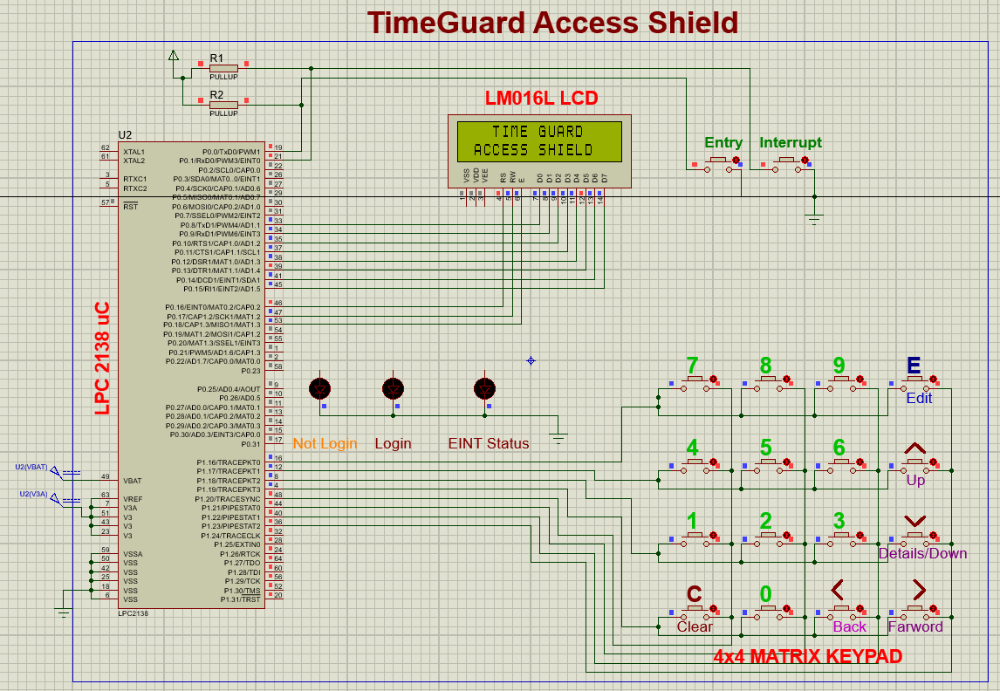

# 🛡️ TimeGuard Access Shield — Password-Controlled Time-Restricted Machine Operation System

TimeGuard Access Shield is an embedded access-control system built using the **LPC2148** microcontroller.  
It combines **secure password authentication**, **RTC-based scheduling**, and an **interrupt-driven configuration menu** to ensure that only authorized users can operate a device — and only at allowed times.

---
## 📸 Project Images

### Proteus Image


---

## 🚀 Features

### 🔐 Password Authentication
- 4-digit password entry through a 4×4 keypad  
- Masked input (`*`)  
- Password change with confirmation  
- Incorrect password lockout  

### ⏱️ RTC Functions
- Displays **time, date, and day**  
- Editable hour, minute, second, date, month, year, weekday  
- Leap-year–based validation  

### 🕒 Time-Based Machine Control
- Device ON only in allowed time window  
- Compares RTC with programmed ON/OFF times  

### 🎛️ Interrupt-Driven Menu (EINT0)
- Edit RTC  
- Change password  
- Edit allowed device timings  
- Exit and return to main display  

---

## 🧩 Hardware Requirements
- LPC2148  
- 16×2 LCD  
- 4×4 Matrix Keypad  
- LED / Relay / Device  
- Push-button (Interrupt)  
- USB–UART Converter / DB9 Cable  

---

## 🛠 Software Requirements
- Embedded C  
- Keil / VS Code ARM toolchain  
- Flash Magic  

---

## 📚 Project Workflow
1. System initializes RTC, LCD, keypad, interrupts  
2. RTC shown continuously  
3. ENTRY switch → Password verification  
4. If valid and time matches → Device ON  
5. EINT0 interrupt → Settings menu  
6. Edit RTC / password / ON-OFF time  
7. Exit and return to normal operation  

---

## 🔧 RTC Edit Options
```
1. Hour      5. Date
2. Minute    6. Month
3. Second    7. Year
4. Day       8. Exit
```

---

## 📁 Repository Structure
```
/src
/include
README.md
```

---

## 🏁 Conclusion
TimeGuard Access Shield ensures **secure, reliable, and time-restricted** machine operation — ideal for labs, workshops, and industrial environments.
